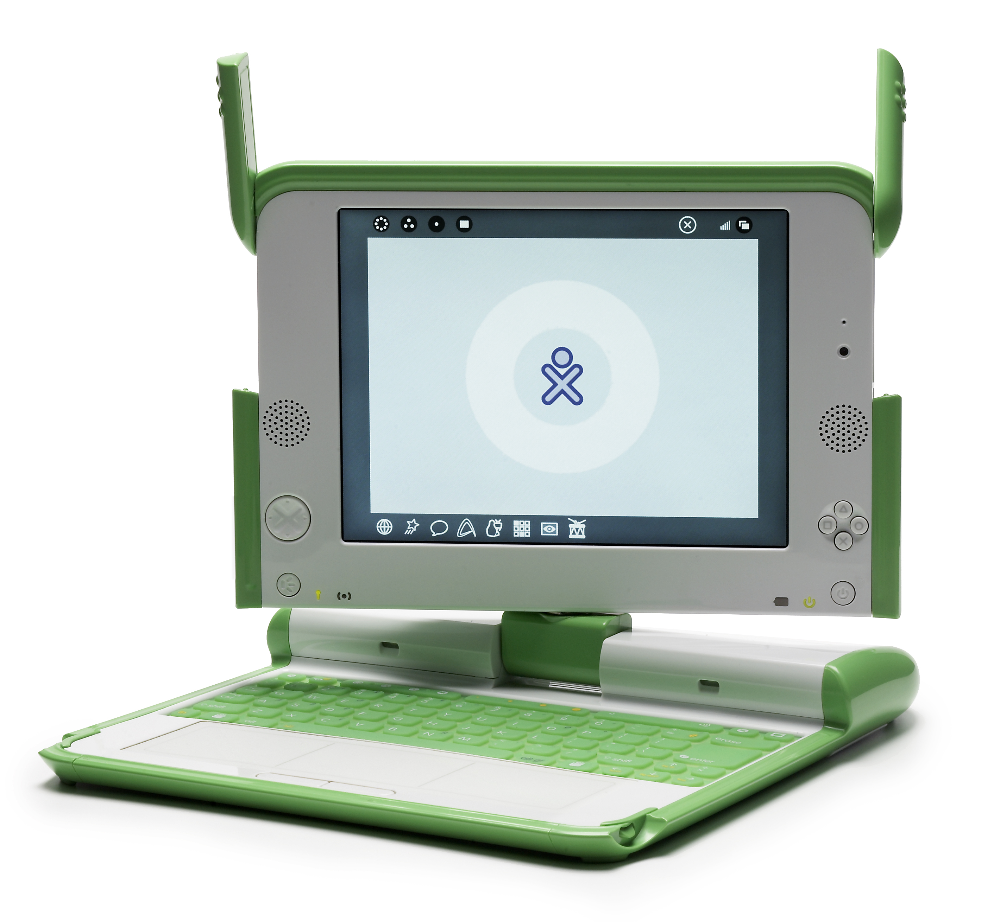

# Hallo Mensch

DatenSindDaten möchte dich mit der Welt der Daten bekannt machen und dich einladen,
zusammen mit uns diese Welt zu erkunden und in ihr zurecht zu finden.
Wir sind ein gemeinnütziger Verein und bieten kostenfreie Veranstaltungen zu Themen der Digitalieserung und der offenen Daten an.

### Mitmachen erwünscht

[newsletter abbonieren](https://oklabflensburg.de)

This paragraph will wrap around the image. The image is floated to the right, and text will flow naturally on the left side of it. You can control the spacing with `margin`, and resize the image using `width` or `height`.

# Sag mir wo die Blumen sind

**Mit einer monumentalen Ausstellung – zu sehen in gleich zwei Museen – ehrt Amsterdam in diesem
Jahr einen der größten deutschen Nachkriegskünstler: den Maler und Bildhauer Anselm Kiefer**, der
im März 2025 seinen 80. Geburtstag feiert. Das Stedelijk Museum Amsterdam untersucht die Beziehung
des Künstlers zu den Niederlanden und stellt ein spektakuläres neues, knapp 25 Meter langes Werk
mit dem Titel „Sag mir wo die Blumen sind“ (oben) ins Zentrum seiner Präsentation.

